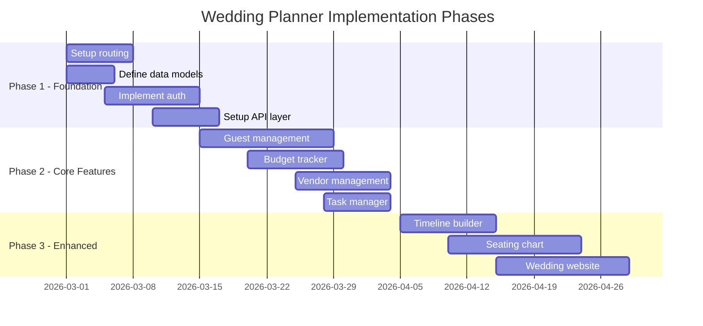

# Wedding Planner Codebase Recommendations

## Executive Summary

This document provides a comprehensive analysis of the **Elysian Wedding Planner** codebase along with actionable recommendations. The project is currently in a scaffolded state with React 19, TypeScript, Zustand, and Zod dependencies configured, but contains only the default Vite template code. The folder structure is well-organized but all directories are empty.

---

## 1. Architecture Improvements

### HIGH PRIORITY

| Issue | Recommendation | Rationale |
|-------|----------------|-----------|
| No routing implementation | Implement React Router v7 or TanStack Router | Wedding planners need multiple views: dashboard, guest list, vendor management, timeline, budget tracker |
| Missing state management architecture | Design Zustand store structure with slices | Create separate slices for: `weddingStore`, `guestStore`, `vendorStore`, `budgetStore`, `timelineStore` |
| No API layer | Implement API service layer with React Query | Essential for data persistence, caching, and synchronization across devices |
| Missing data models | Define TypeScript interfaces and Zod schemas | Core entities needed: Wedding, Guest, Vendor, Budget, Timeline, Task, Venue |

### MEDIUM PRIORITY

| Issue | Recommendation | Rationale |
|-------|----------------|-----------|
| No component architecture | Implement atomic design pattern | Organize components into atoms, molecules, organisms, templates, and pages |
| Missing error boundaries | Add React Error Boundaries | Prevent entire app crashes from component errors |
| No lazy loading setup | Implement code splitting with React.lazy | Improve initial load time for larger feature sets |
| Missing environment configuration | Add environment variable management | Separate configs for dev, staging, and production |

### LOW PRIORITY

| Issue | Recommendation | Rationale |
|-------|----------------|-----------|
| No micro-frontend consideration | Evaluate module federation for scale | If the app grows significantly, consider splitting into independent modules |
| Missing service worker | Add PWA capabilities with Workbox | Enable offline functionality for venue visits without connectivity |

---

## 2. Missing Features to Implement

### HIGH PRIORITY - Core Features

```
┌─────────────────────────────────────────────────────────────────┐
│                    WEDDING PLANNER CORE FEATURES                │
├─────────────────────────────────────────────────────────────────┤
│                                                                 │
│  ┌──────────────┐    ┌──────────────┐    ┌──────────────┐      │
│  │   Dashboard  │    │  Guest List  │    │   Budget     │      │
│  │   Overview   │    │  Management  │    │   Tracker    │      │
│  └──────────────┘    └──────────────┘    └──────────────┘      │
│                                                                 │
│  ┌──────────────┐    ┌──────────────┐    ┌──────────────┐      │
│  │   Vendor     │    │   Timeline   │    │    Task      │      │
│  │  Management  │    │   Builder    │    │   Manager    │      │
│  └──────────────┘    └──────────────┘    └──────────────┘      │
│                                                                 │
│  ┌──────────────┐    ┌──────────────┐    ┌──────────────┐      │
│  │    Venue     │    │   Seating    │    │   Wedding    │      │
│  │   Selector   │    │   Planner    │    │   Website    │      │
│  └──────────────┘    └──────────────┘    └──────────────┘      │
│                                                                 │
└─────────────────────────────────────────────────────────────────┘
```

| Feature | Description | Components Needed |
|---------|-------------|-------------------|
| **Guest Management** | RSVP tracking, meal preferences, plus-ones | GuestList, GuestCard, RSVPForm, GuestImport |
| **Budget Tracker** | Expense tracking, vendor payments, budget allocation | BudgetOverview, ExpenseList, PaymentTracker |
| **Vendor Management** | Contact info, contracts, payment schedules | VendorList, VendorCard, ContractUpload |
| **Timeline Builder** | Day-of schedule, vendor arrival times | TimelineView, EventBlock, TimelineExport |
| **Task Manager** | Checklist with due dates, assignments | TaskList, TaskItem, TaskFilters |

### MEDIUM PRIORITY - Enhanced Features

| Feature | Description | Components Needed |
|---------|-------------|-------------------|
| **Seating Chart** | Drag-and-drop table arrangement | SeatingCanvas, TableCard, GuestAssignment |
| **Venue Comparison** | Side-by-side venue analysis | VenueCard, ComparisonMatrix, VenueMap |
| **Wedding Website** | Public-facing wedding page | WebsiteBuilder, ThemeSelector, RSVPIntegration |
| **Document Storage** | Contracts, inspiration boards | FileUpload, DocumentViewer, FolderStructure |

### LOW PRIORITY - Nice-to-Have Features

| Feature | Description | Components Needed |
|---------|-------------|-------------------|
| **Guest Communication** | Email/SMS integration | MessageComposer, TemplateManager, SendLog |
| **Vendor Reviews** | Rate and review vendors | ReviewForm, RatingSystem, ReviewList |
| **Budget Analytics** | Spending insights and projections | Charts, AnalyticsDashboard, ExportPDF |
| **Multi-wedding Support** | Planner professionals managing multiple events | WeddingSwitcher, DashboardOverview |

---

## 3. Code Quality Suggestions

### HIGH PRIORITY

| Issue | Current State | Recommendation |
|-------|---------------|----------------|
| Default template code | [`App.tsx`](src/App.tsx:1) contains Vite counter example | Replace with actual wedding planner components |
| Generic page title | [`index.html`](index.html:7) has placeholder title | Update to "Elysian Wedding Planner" |
| No component library | No UI components exist | Consider shadcn/ui, Radix UI, or Chakra UI for consistent design |
| Missing CSS architecture | Basic CSS files without methodology | Implement Tailwind CSS or CSS Modules with BEM naming |

### MEDIUM PRIORITY

| Issue | Current State | Recommendation |
|-------|---------------|----------------|
| No custom hooks | [`hooks/`](src/hooks/.gitkeep) directory empty | Create hooks: `useWedding`, `useGuests`, `useBudget`, `useVendors` |
| No utility functions | [`utils/`](src/utils/.gitkeep) directory empty | Add: date formatting, currency handling, validation helpers |
| No type definitions | [`types/`](src/types/.gitkeep) directory empty | Define: Wedding, Guest, Vendor, Budget, Task interfaces |
| No Zod schemas | [`schemas/`](src/schemas/.gitkeep) directory empty | Create validation schemas for all data models |

### LOW PRIORITY

| Issue | Current State | Recommendation |
|-------|---------------|----------------|
| No Storybook | Component documentation missing | Add Storybook for component development and documentation |
| No Husky/lint-staged | No pre-commit hooks | Add automated linting and formatting on commit |
| No commitlint | No commit message standards | Enforce conventional commits for better changelog generation |

---

## 4. Testing Recommendations

### HIGH PRIORITY

| Test Type | Coverage Target | Tools to Use |
|-----------|-----------------|--------------|
| Unit Tests | 80%+ for utilities and hooks | Vitest + Testing Library |
| Component Tests | 70%+ for UI components | Vitest + Testing Library |
| Integration Tests | Critical user flows | Vitest + MSW for API mocking |

**Recommended Test Structure:**

```
src/
├── components/
│   └── GuestList/
│       ├── GuestList.tsx
│       ├── GuestList.test.tsx
│       └── GuestList.module.css
├── hooks/
│   └── useGuests/
│       ├── useGuests.ts
│       └── useGuests.test.ts
└── utils/
    └── formatDate/
        ├── formatDate.ts
        └── formatDate.test.ts
```

### MEDIUM PRIORITY

| Test Type | Purpose | Tools to Use |
|-----------|---------|--------------|
| E2E Tests | Full user journey validation | Playwright or Cypress |
| Visual Regression | UI consistency across changes | Percy or Chromatic |
| Accessibility Tests | WCAG compliance | axe-core + jest-axe |

### LOW PRIORITY

| Test Type | Purpose | Tools to Use |
|-----------|---------|--------------|
| Performance Tests | Load time and responsiveness | Lighthouse CI |
| Contract Tests | API compatibility | Pact |
| Mutation Tests | Test quality verification | Stryker |

---

## 5. Security Considerations

### HIGH PRIORITY

| Risk | Mitigation Strategy |
|------|---------------------|
| **Authentication Required** | Implement Auth0, Clerk, or Supabase Auth for user identity |
| **Data Encryption** | Encrypt sensitive data at rest and in transit using TLS 1.3 |
| **Input Validation** | Use Zod schemas for all user inputs; sanitize on both client and server |
| **XSS Prevention** | Use React's built-in escaping; avoid `dangerouslySetInnerHTML` |
| **CSRF Protection** | Implement CSRF tokens for all state-changing operations |

### MEDIUM PRIORITY

| Risk | Mitigation Strategy |
|------|---------------------|
| **File Upload Security** | Validate file types, scan for malware, limit file sizes |
| **Rate Limiting** | Implement rate limiting on API endpoints to prevent abuse |
| **Session Management** | Use secure, httpOnly cookies; implement session timeout |
| **Third-party Integrations** | Audit all third-party dependencies; use lockfiles |

### LOW PRIORITY

| Risk | Mitigation Strategy |
|------|---------------------|
| **Content Security Policy** | Implement strict CSP headers |
| **Subresource Integrity** | Add SRI hashes for external scripts |
| **Security Headers** | Configure HSTS, X-Frame-Options, X-Content-Type-Options |

---

## 6. Performance Optimizations

### HIGH PRIORITY

| Area | Current Issue | Optimization |
|------|---------------|--------------|
| Bundle Size | No code splitting | Implement route-based code splitting with React.lazy |
| Image Handling | No optimization | Use responsive images with srcset; consider Cloudinary |
| State Updates | N/A - no state yet | Use Zustand's shallow comparisons; memoize selectors |

### MEDIUM PRIORITY

| Area | Optimization |
|------|--------------|
| List Rendering | Implement virtualization for long guest lists using react-window |
| Form Performance | Use React Hook Form for efficient form state management |
| API Caching | Implement React Query for automatic caching and background refetching |
| Asset Optimization | Configure Vite for asset inlining and hash-based caching |

### LOW PRIORITY

| Area | Optimization |
|------|--------------|
| Font Loading | Implement font-display: swap; preload critical fonts |
| Critical CSS | Extract and inline critical CSS for above-the-fold content |
| Service Worker | Cache static assets and API responses for offline support |

---

## Implementation Roadmap



---

## Recommended Tech Stack Additions

| Category | Recommended Package | Purpose |
|----------|---------------------|---------|
| Routing | `react-router-dom` or `@tanstack/router` | Client-side routing |
| Forms | `react-hook-form` + `@hookform/resolvers` | Form state management with Zod validation |
| Data Fetching | `@tanstack/react-query` | Server state management and caching |
| UI Components | `@radix-ui/react-*` + `tailwindcss` | Accessible, customizable components |
| Drag and Drop | `@dnd-kit/core` | Seating chart and timeline interactions |
| Date Handling | `date-fns` | Date manipulation and formatting |
| Charts | `recharts` | Budget analytics and visualizations |
| PDF Export | `@react-pdf/renderer` | Export timeline and guest lists |
| Icons | `lucide-react` | Consistent icon library |

---

## Conclusion

The Elysian Wedding Planner project has a solid foundation with modern tooling (React 19, TypeScript, Vite, Zustand, Zod). However, it requires significant development to become a functional wedding planning application. The recommendations above are prioritized to guide development from foundational architecture through feature implementation, with attention to code quality, security, and performance throughout.

**Immediate Next Steps:**
1. Replace default template code with wedding planner components
2. Implement routing and authentication
3. Define core data models with TypeScript and Zod
4. Build the guest management feature as the first MVP feature
